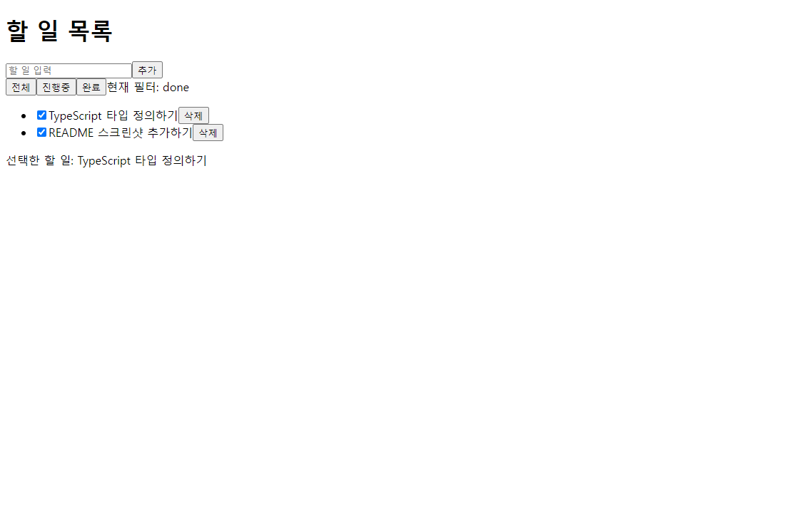
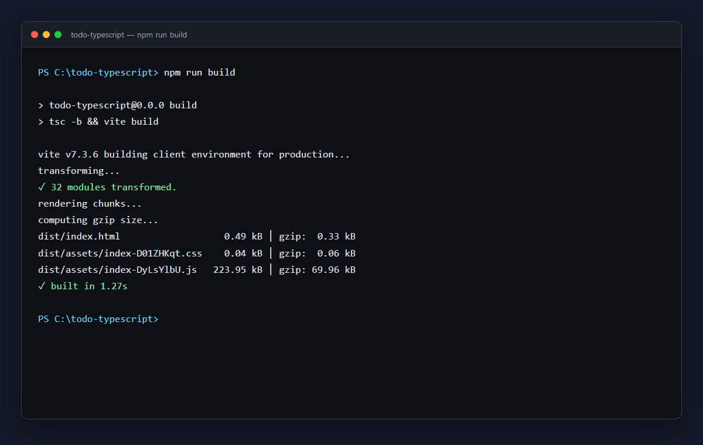

# TypeScript Todo List

JavaScript로 작성된 To-Do 앱을 React와 TypeScript 프로젝트로 마이그레이션한 과제입니다.

## 실행 방법

```bash
npm install
npm run dev
```

## 검사 방법

```bash
npm run build
npm run lint
```

## 구현 내용

- 할 일 추가, 완료 여부 변경, 삭제
- 전체/진행중/완료 필터
- 선택한 할 일 표시
- 공용 `Todo`, `Filter` 타입 분리
- 컴포넌트 props를 `interface`로 정의
- `any`, 타입 단언, non-null assertion 없이 타입 안전성 확보
- 주어진 JavaScript의 기능과 JSX 구조를 유지하고 타입만 추가

## 실행 화면

TypeScript 타입 정의하기, README 스크린샷 추가하기 두 할 일을 추가한 뒤, 두 항목을 완료 처리하고 `완료` 필터와 선택 상태를 확인한 화면입니다.



## 빌드 성공 화면

`npm run build` 명령으로 TypeScript 타입 검사와 Vite 프로덕션 빌드가 모두 성공한 결과입니다.


